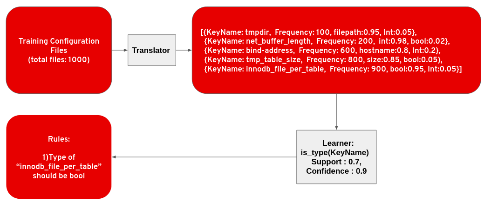
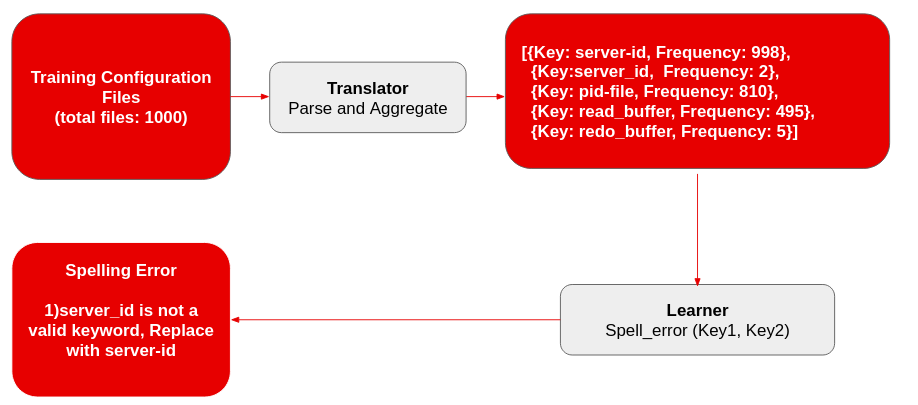

_Author(s):_ Sanket Badhe, Shrey Anand, Marcel Hild

_Date Created:_ 10/06/2020

_Date Updated:_ 10/06/2020

_Tags:_ configuration files, similarity index, misconfiguration detection, unsupervised learning, association Rule Learning

# Abstract

Software systems have become more flexible and feature-rich. For example, the configuration file for MySQL has more than 200 configuration entries with different subentries.  As a result, configuring these systems is a complicated task and frequently causes configuration errors. Currently, in most cases, misconfigurations are detected by manually specified rules. However, this process is tedious and not scalable. In this project, we propose data-driven methods to detect misconfigurations by discovering frequently occurring patterns in configuration files. 

# Introduction

Configuration errors are one of the major underlying causes of modern software system failures [[1](http://cseweb.ucsd.edu/~tixu/papers/csur.pdf)]. In 2017, AT&T’s  911 service went down for 5 hours because of a system configuration change [[2](https://thehill.com/policy/technology/325510-over-12000-callers-couldnt-reach-911-during-att-outage)]. About 12600 unique callers were not able to reach 911 during that period. In another similar incident, Facebook and Instagram went down because of a change that affected facebook’s configuration systems [[3](https://mashable.com/2015/01/27/facebook-tinder-instagram-issues/)]. These critical system failures are ubiquitous - In one empirical study, researchers found that the percentage of system failure caused by configuration errors is higher than the percentage of failure resulting from bugs, 30% and 20% respectively [[4](https://atg.netapp.com/wp-content/uploads/2011/10/sosp11-yin.pdf)]. 

Some of the configuration files are written by experts and customized by users such as tuned files, while others are completely configured by end-users. When writing configuration files, users usually take existing files and modify them with little knowledge of the system. The non-expert user can then easily introduce errors. Even worse, the original file may already be corrupted, and the errors are propagated further. In this blog, we explored misconfiguration detection in MySQL configuration files using data-driven methods. 

## Misconfiguration detection framework

The misconfiguration detection framework adopted in this project is inspired by the research paper "Synthesizing Configuration File Specifications with Association Rule Learning" [[5](http://www.cs.yale.edu/homes/zhai-ennan/configv-oopsla17.pdf)]. Association rule learning is a method to discover frequently occurring patterns or associations between variables in a dataset. In association rule learning, support and confidence are two metrics widely used to filter the proposed rules. Support is the percentage of times that the keywords in the proposed rule have been seen in the training configuration files. Confidence is the percentage of times the proposed rule has held true over the training configuration files.

Figure 1. overview of the misconfiguration detection framework. It has two important modules: translator and learner. 

* Translator: Translator works as a parser, translator converts raw configuration files into an intermediate representation which generally has a format of key, value, data type, frequency (k, v, τ, f)

* Learner: Learner discovers frequently occurring patterns or associations between keywords in configuration files to derive rules.

The following section illustrated the different class of errors based on different patterns in our configuration file.

### Data type error detection 

Many system failure issues are caused by assigning values of an incorrect data type to a keyword. In this method, for each key, we match the data type of target with the data type information inferred from the training set. An error is reported if the matching fails. We used a set of heuristics to infer the predefined data types from the given value. Our framework detects the bool, size, int, hostname/IP address, file path, filename, URI, string data types.

Steps for type error detection

1. Translator parses the configuration files, determines the data type of values, and aggregate results for each key. 

2. Learner proposes rules by assigning every possible datatype to each keyword in configuration files. Then filter proposed rules using support and confidence. 

Figure 2. Data type error detection.

### Spelling error detection 

Misspelling in key names is a common and subtle error that might be resulting in a default value assignment, causing impaired performance and reliability that may be challenging to track down. 

Steps for spelling error detection

1. Translator finds the frequency of each keyword across the training set. 

2. Learner proposes errors by mapping lower frequency keywords to a similar higher frequency keyword. We calculated the similarity between keywords using Levenshtein distance. Finally, the learner filters the proposed errors using support and confidence.

Figure 3. Spelling error detection

## Results

We used a publicly available dataset of 256 MySQL configuration files to train the misconfiguration detection framework [[6](https://github.com/tianyin/configuration_datasets)]. We evaluated our framework by analyzing the detected errors in the existing MySQL configuration files dataset. Most of the detected data type and spelling errors were indeed true errors. In the following section, we have given examples of errors that our framework detected.

### Data type error detection

MySQL configuration file has a key *‘socket’ *which expects a value as a full directory and file name, i.e., location for socket file that the server uses for communication with local clients [[7](https://dev.mysql.com/doc/refman/8.0/en/problems-with-mysql-sock.html)]. A user assigned incorrect values to the key *socket* while editing the configuration file, in table 1, we demonstrated the detected error. 

| Correct Format | Incorrect format | Error Message |
|:-----|:------|:------|
| socket= '/var/lib/mysql/mysql.sock’ | socket=‘MySql’ | TypeError: Data type of key ‘log_file’ should be ‘filename or filepath+filename' but it’s given as 'filepath' |

Table 1. Example of data type error detection 

### Spelling error detection 

One of the most misconfigured MySQL performance features is 'query_cache_size' [[8](https://haydenjames.io/mysql-query-cache-size-performance/)]. 'query_cache_size' system variable is used for query caching, and it can significantly improve the performance of the MySQL systems. A user assigned 20M memory to 'query_cache_size' to improve the performance but misspelled key as 'query-cache-size' resulting in a default 1M memory assignment causing poor performance. In table 2, we demonstrated the detected error. 

| Correct Format | Incorrect format | Error Message |
|:-----|:------|:------|
| query_cache_size= 20 M | query-cache-size= 20 M | SpellError: Key ‘query-cache-size' should be replaced by ‘query_cache_size’ |

Table 2. Example of spelling error detection 

# Conclusion

In this project, we discovered frequently occurring patterns in MySQL configuration files to detect misconfiguration. We experimented with two types of errors based on patterns in configuration files.  We detected data type errors by matching the target key data type with the data type information inferred from the training set. We detected spelling error by mapping lower frequency keyword to a similar higher frequency keyword. We can easily extend this to include other types of errors based on patterns in the configuration files. The results suggest that we can automate the misconfiguration detection task using data-driven methods for all types of key-values based configuration files. 

# References

\[1\] [http://cseweb.ucsd.edu/~tixu/papers/csur.pdf](http://cseweb.ucsd.edu/~tixu/papers/csur.pdf)

\[2\] [https://thehill.com/policy/technology/325510-over-12000-callers-couldnt-reach-911-during-att-outage](https://thehill.com/policy/technology/325510-over-12000-callers-couldnt-reach-911-during-att-outage)

\[3\] [https://mashable.com/2015/01/27/facebook-tinder-instagram-issues/](https://mashable.com/2015/01/27/facebook-tinder-instagram-issues/)

\[4\] [https://atg.netapp.com/wp-content/uploads/2011/10/sosp11-yin.pdf](https://atg.netapp.com/wp-content/uploads/2011/10/sosp11-yin.pdf)

\[5\] [http://www.cs.yale.edu/homes/zhai-ennan/configv-oopsla17.pdf](http://www.cs.yale.edu/homes/zhai-ennan/configv-oopsla17.pdf)

\[6\] [https://github.com/tianyin/configuration_datasets](https://github.com/tianyin/configuration_datasets)

\[7\] [https://dev.mysql.com/doc/refman/8.0/en/problems-with-mysql-sock.html](https://dev.mysql.com/doc/refman/8.0/en/problems-with-mysql-sock.html)

\[8\] [https://haydenjames.io/mysql-query-cache-size-performance/](https://haydenjames.io/mysql-query-cache-size-performance/)

# Project Materials

### Steps to get you started:

1. Visit [jupyterhub.datahub.redhat.com](https://jupyterhub.datahub.redhat.com/)

2. Login with your Kerberos ID

3. In this Spawn screen, select s2i-configuration-files-analysis-notebook:latest, in the memory size select Large ( Memory: 8Gi, CPU 2)

4. Once your server starts, go into the directory named categorical-encoding-yyyy-mm-dd-hh-mm/demo

### How to Contribute / Provide feedback

* Github Repository: [https://github.com/aicoe-aiops/configuration-files-analysis](https://github.com/aicoe-aiops/configuration-files-analysis)

* You can open up a PR on the Git Repository highlighting the feature or issue, and we will address it.

* You can also reach out to sbadhe@redhat.com for any questions.

